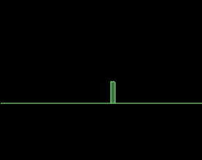
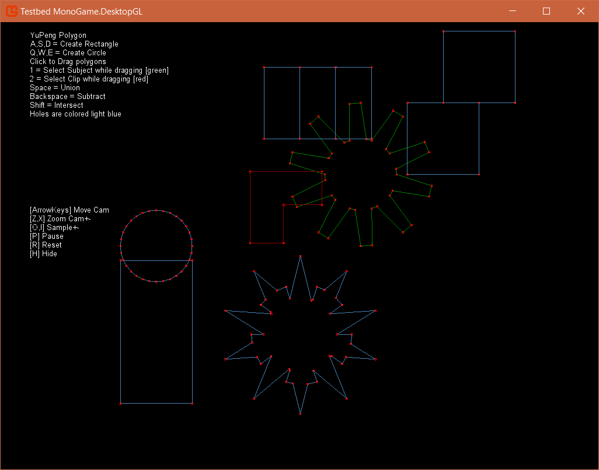
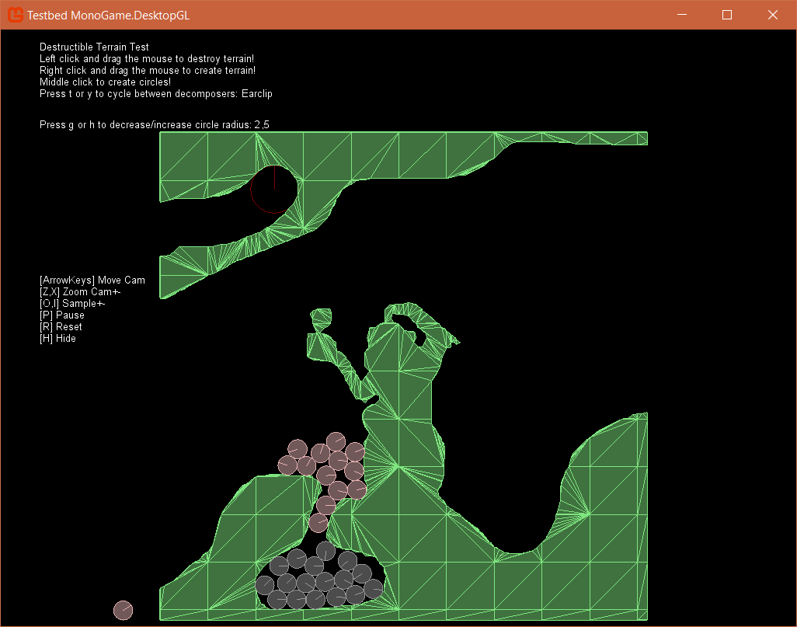

# Farseer Physics Engine + TestBed Port to MonoGame 3.6!

This is a port of the **Farseer Physics Engine** (including the **DebugView** as well as the **TestBed**). With this repo you will get the original TestBed of the Farseer Physics Engine (Box2D) which is working with new newest MonoGame interation 3.6!

### Building

The following is required to successfully compile the solution:

- MonoGame 3.6 (DesktopGL)
- Farseer Physics Engine (Source included)
- Farseer Physics Engine DebugView (Source included)
- Visual Studio 2015

### Changes

I did some small additions / modifications to the original TestBed of the Farseer Physics Engine like displaying a (hideable) control info, which makes it easier to control the app.

I also enabled the "DesctructibleTerrain" sample, because it worked good enough for me and it's great to get a clue of how this is working. It may be possible that the app crashes when using the "seidel" decomposer in this sample. Other than that it was working great for me.

### How To

Well, I think everything is pretty self-axplaining, because everything about this TestBed is to learn from its samples and do smaller or bigger tests ;-)

I think it's a very great way to learn how the Farseer Physics Engine (which is originally a port of Box2D) is working. When you still encounter problems, then it's a useful thing to google for Box2D samples / tutorials. They are nearly working the same in the Farseer Physics Engine.

## Samples

Testbed: [MonoGame.DesktopGL/Tests](https://github.com/sqrMin1/Farseer-Physics-TestBed-Port-MonoGame-3.6/tree/master/Testbed%20MonoGame.DesktopGL/Tests)

Click on the link to get an overview of all the samples, which are included in this repo!

**Have fun!**

> Note: The Farseer Physics Engine is now officially called "[Velcro Physics](https://github.com/VelcroPhysics/VelcroPhysics)". Feel free to check the official git repo out!
